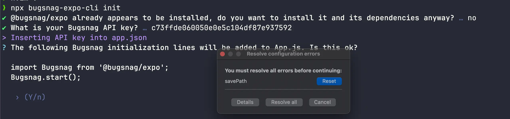

## Set Up BugSnag

Out of the box, errors will be logged to the console. To set up BugSnag, follow these steps:

1. Set up a project in BugSnag.
2. Run `npx bugsnag-expo-cli init`. 
3. No need to install @bugsnag/expo again, so answer `no` to the first question.
4. Enter your Api Key (on your Bugsnag Project Dashboard).
5. Answer `No` when the CLI asks you to add code to `App.js` (which does not exist in this project).
6. If you want to upload source maps automatically, answer `yes`, otherwise `no`. You can always upload source maps later manually, or rerun the script if you change your mind.
7. You can use Bugsnag by importing `import { reportError } from "~/lib/report-error";` and then use reportError like so `reportError(someError)`.
