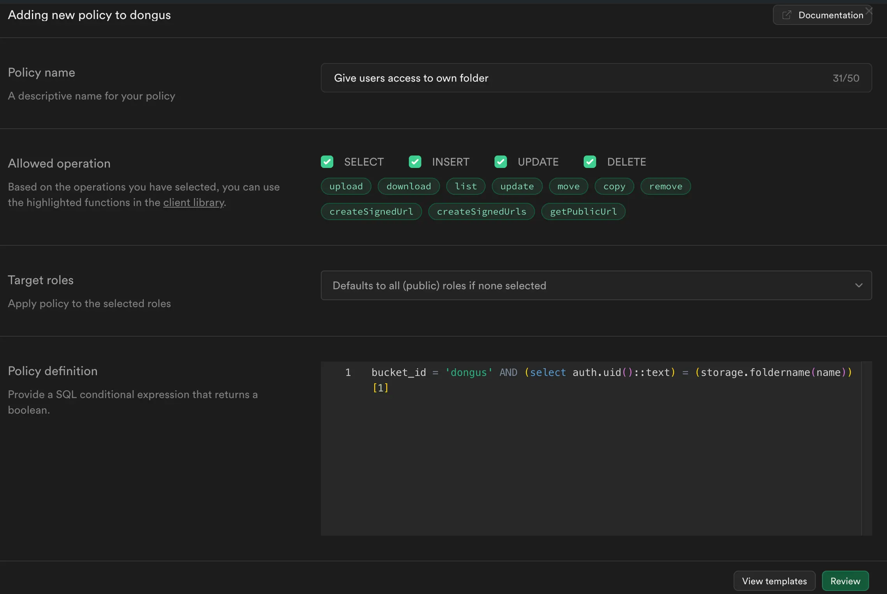
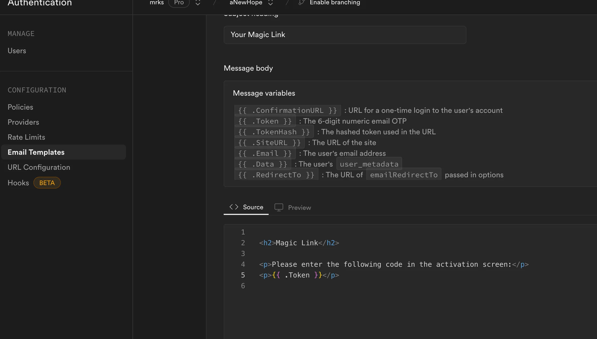
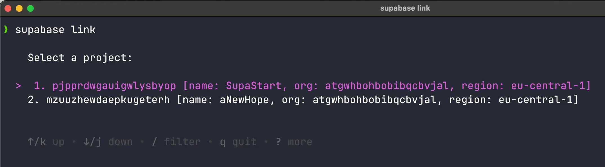

## Prerequisites

The terminal commands used assume Mac or Linux, if you are on a Windows machine, you may want to use [WSL](https://learn.microsoft.com/en-us/windows/wsl/install).

Make sure you have the Supabase CLI installed. To check, run `supabase --version` in your terminal.

If you haven't installed the Supabase CLI, you can do so with the following command `npm install supabase -g`. If you're not familiar with the Supabase CLI, you can check the [Supabase docs](https://supabase.com/docs/guides/cli/getting-started).

## Clone the repo and install

1. Clone this repo. `git clone https://github.com/mrkshm/rnlaunchpad.git`
2. Move into the new folder. `cd rnlaunchpad`
3. Install the dependencies. `npm install`
4. Rename `example.env` to `.env`.
5. In this .env file, set `IOS_BUNDLE_IDENTIFIER` and `ANDROID_PACKAGE_NAME` to your desired values.

## Set up SupaBase

1. Set up a new Supabase project.
2. Find your Supabase Project URL (in the Supabase Dashboard home page under Project API) and enter it in the .env file ("EXPO_PUBLIC_SUPABASE_URL").
3. Find your Supabase API Key (same place as the Project URL) and enter it in the .env file ("EXPO_PUBLIC_SUPABASE_ANON_KEY").
4. In Supabase, under the Storage tab, create a bucket.
5. Enter the name of your newly created Storage bucket in the .env file ("EXPO_PUBLIC_SUPABASE_USER_BUCKET").
6. Create a policy for your storage bucket.
   - Choose "Get Started Quickly".
   - Choose "Give users access to only their own top level folder named as uid".
   - Allow all operations (DELETE, UPDATE, INSERT, SELECT).
     
7. In the Authentication tab under Email Templates, change the email templates for "Confirm signup", "Magic Link", "Change Email Address" and "Reset Password" to something like:  
   `
Please enter the following code in the activation screen
`  
   `
{{ .Token }}
`.  
   
8. Link your local project with the Supabase project. `supabase link`, then choose the project you just created.  
   
9. Before pushing the migrations, you may want to add fields to `public.user_profiles`. You can do so in `/supabase/migrations/20240527074130_initial_migration.sql`.
10. Push the migrations (`supabase db push`). When asked if you want to push the migrations, confirm by pressing `Y`.
